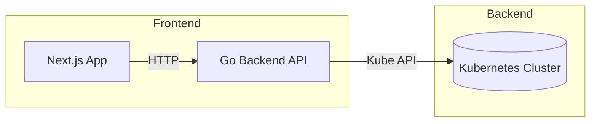

# Crossplane Spy

This web application aims to offer a simple dashboard for
[Crossplane v2](https://docs.crossplane.io/latest/whats-new/).

Deploy it quickly in the cluster where crossplane is installed, access the web
application and instantly discover all the crossplane resources whether they are
**cluster scope** (`crossplane-system` namespace) or **namespace scope**
(leaving in any from any other namespace).

The application discover and list each kind of resources (`Provider`,
`ProviderConfig`, `XRD`, `Composition`, `XR`, `Functions`) with the related
status conditions, and help understanding relations between each type of object.

Resources list can be filtered regarding multiple criteria in order easily find
what you're looking for.

Data are frequently refreshed to see any changes.

## Features

- **Resource Discovery**: Automatically discover all Crossplane resources in your cluster
- **Scope Awareness**: Clear distinction between cluster-scoped and namespace-scoped resources
- **Detailed Status Monitoring**:
  - Providers & Functions: View Installed + Healthy status
  - XRDs: View Established status
  - Composite Resources: View Ready/Synced status
- **Package Organization**: Display package and API group for each resource to understand naming strategies
- **Relationship Mapping**: Understand connections between resources (XRDs, Compositions, XRs)
- **Educational Tool**: Helps visualize Crossplane v2 concepts and multi-tenancy

## Quick Start

### Using Docker (Recommended)

```bash
# Build the image
make docker-build

# Run the container
make docker-run
```

Access the dashboard at `http://localhost:3000`.

### Using Helm

```bash
# Install in your cluster
helm install crossplane-spy ./helm/crossplane-spy

# Port-forward to access locally
kubectl port-forward svc/crossplane-spy 3000:3000
```

### Local Development

```bash
# Start both backend and frontend
make dev
```

See [Development Guide](docs/development.md) for detailed instructions.

## Architecture



Read more in [Architecture Documentation](docs/architecture.md).

## Documentation

- [Architecture](docs/architecture.md) - System design and component overview
- [Development Guide](docs/development.md) - How to develop and contribute
- [Backend README](backend/README.md) - Backend-specific documentation
- [Frontend README](frontend/README.md) - Frontend-specific documentation

## Tech Stack

**Backend**
- Go 1.23+
- Gin web framework
- Kubernetes client-go

**Frontend**
- Next.js 15
- TypeScript
- TailwindCSS
- shadcn/ui components

## Contributing

This is an educational tool for the Crossplane community. Contributions are welcome!

1. Fork the repository
2. Create your feature branch (`git checkout -b feature/amazing-feature`)
3. Commit your changes (`git commit -m 'feat: add amazing feature'`)
4. Push to the branch (`git push origin feature/amazing-feature`)
5. Open a Pull Request

## License

This project is licensed under the Apache License 2.0 - see the [LICENSE](LICENSE) file for details.

## Use Cases

### Platform Teams
- Monitor Crossplane installation health
- Understand resource relationships
- Debug composition issues
- Validate multi-tenancy setup

### Training & Education
- Learn Crossplane v2 concepts
- Visualize cluster vs namespace scope
- Understand package and CRD naming conventions
- See real-time impact of changes

## Requirements

- Kubernetes cluster with Crossplane v2 installed
- Read-only access to Crossplane resources (via RBAC)
