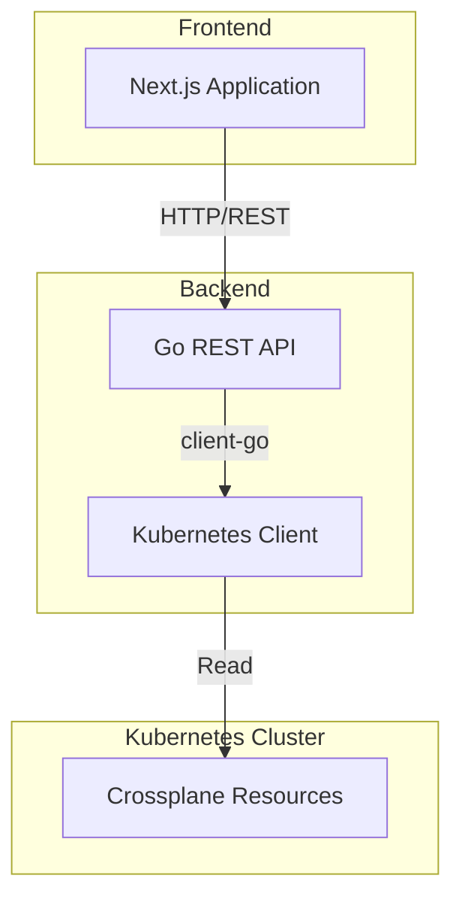
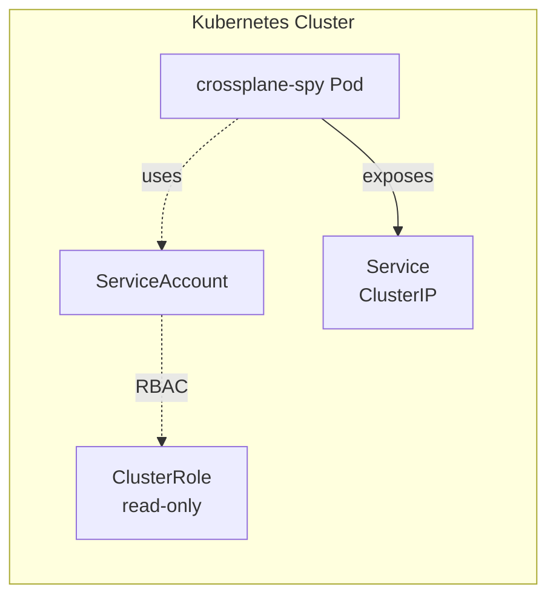

# Architecture

## Overview

Crossplane Spy is a dashboard application for visualizing and managing Crossplane v2 resources in Kubernetes clusters.

## Architecture Diagram

## Components

### Frontend (Next.js)
- **Technology**: Next.js 15 with App Router, TypeScript, TailwindCSS, shadcn/ui
- **Responsibilities**:
  - User interface for resource visualization
  - Filtering and search functionality
  - Real-time data refresh
  - Responsive design

### Backend (Go)
- **Technology**: Go with Gin framework and client-go
- **Responsibilities**:
  - REST API endpoints
  - Kubernetes cluster communication
  - Resource discovery and listing
  - Scope detection (cluster vs namespace)
  - Relationship mapping between resources

## Resource Scopes

### Cluster-Scoped Resources
Resources that exist at the cluster level (typically in `crossplane-system` namespace):
- **Provider**: Package installations
- **ProviderConfig**: Provider configurations
- **XRD** (CompositeResourceDefinition): API definitions
- **Composition**: Infrastructure templates
- **Function**: Composition functions

### Namespace-Scoped Resources
Resources that can exist in multiple namespaces (v2 feature):
- **XR** (Composite Resources): User-created instances
- Namespace-scoped ProviderConfigs (when configured)

## Data Flow

1. Frontend requests resource data via REST API
2. Backend queries Kubernetes API using client-go
3. Backend discovers resources using dynamic client
4. Backend processes and enriches data:
   - Determines scope (cluster/namespace)
   - Identifies relationships (owner references, labels)
   - Extracts status conditions
5. Backend returns JSON to frontend
6. Frontend renders data with appropriate UI components

## Security Model

- **Authentication**: No built-in auth (cluster internal use)
- **Authorization**: RBAC via Kubernetes ServiceAccount
- **Permissions**: Read-only access to Crossplane resources
- **Network**: ClusterIP service (no external exposure by default)

## Deployment Model

## Technology Choices

### Why Go for Backend?
- Native Kubernetes integration with client-go
- Excellent performance for API queries
- Strong typing for K8s resources
- Easy containerization (single binary)

### Why Next.js for Frontend?
- Modern React framework with SSR/SSG capabilities
- Excellent developer experience
- Great ecosystem (TailwindCSS, shadcn/ui)
- Built-in optimization and performance features

## Future Considerations

- WebSocket/SSE for real-time updates
- Resource relationship graph visualization
- Export functionality (YAML, JSON)
- Resource comparison tools
- Historical data tracking
